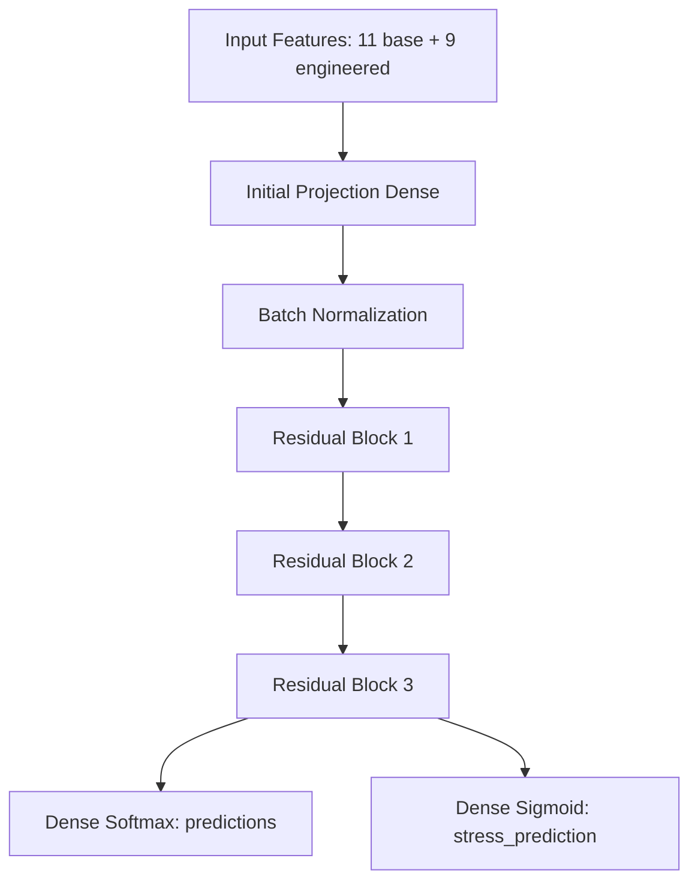

# Implementation Plan - MindCare AI Model Stress Level Estimation

This plan outlines the changes required to upgrade the MindCare AI model. The goal is to estimate and display the user's stress level (0–100%) alongside activity recommendations, using the existing deep learning framework (FFNN + Residual Blocks).

## Proposed Approach

To achieve this without using a separate machine learning model, we will convert the current single-output Neural Network into a **Multi-Output Deep Learning Model** using the Keras Functional API.

### 1. Multi-Task Learning Architecture
The model will share the representation layers (Initial Projection & 3 Residual Blocks) and branch into two outputs:
- **Output 1 (`predictions`)**: Classification branch (Softmax) for recommending the activity (`membaca`, `journaling`, `olahraga`).
- **Output 2 (`stress_prediction`)**: Regression branch (Sigmoid) predicting the normalized stress level in the range `[0, 1]` based on the `psikologis_score` target in the dataset.



### 2. Dataset Target Selection
- We will use the `psikologis_score` column from `data_train.csv` (which ranges from `0.0` to `96.19`) as the target for the stress percentage regression.
- Since it is bounded under 100, we will scale it to `[0, 1]` during training by dividing it by `100.0`.
- The regression branch will use a `Sigmoid` activation, ensuring the model output is bounded in `[0, 1]`. During inference, this is multiplied by `100.0` to get the percentage.

## Proposed Changes

### Core Model & Training
#### [MODIFY] [train.py](file:///d:/NIKKI%20INDRA%20SYAPUTRA/dicoding%20camp%20DBS%20Foundation/PROJECT_RECOMENDASI/train.py)
- Modify `build_model` to:
  - Add the regression output branch `stress_prediction` (Dense layer with `sigmoid` activation).
  - Compile the model with multiple losses: `WeightedCategoricalCrossentropy` for classification and `mse` (Mean Squared Error) or `mae` for regression.
  - Set loss weights (e.g., `1.0` for classification, `1.5` for regression to balance learning).
- Modify `train_model` to:
  - Extract and normalize `psikologis_score` to create regression labels `y_train_stress`, `y_test_stress`, `y_val_stress`.
  - Update `fit()` to pass dictionaries of inputs and outputs.
  - Update `OverfittingLogger`, `EarlyStopping`, and `ReduceLROnPlateau` callbacks to monitor `val_predictions_accuracy` (the updated metric name generated by Keras for multi-output classification).
  - Save the newly trained multi-output model to `model.keras`.

### Inference Engine
#### [MODIFY] [predict.py](file:///d:/NIKKI%20INDRA%20SYAPUTRA/dicoding%20camp%20DBS%20Foundation/PROJECT_RECOMENDASI/predict.py)
- Update `DeepLearningInference.recommend(user_json)`:
  - Perform multi-output inference: `preds_activity, preds_stress = self.model.predict(...)`.
  - Denormalize the stress output by multiplying by `100.0` to obtain `stress_percentage`.
  - Classify the stress level based on the range:
    - `0–20%` : Sangat Rendah
    - `21–40%` : Rendah
    - `41–60%` : Sedang
    - `61–80%` : Tinggi
    - `81–100%` : Sangat Tinggi
  - Generate a descriptive `keterangan` based on the category.
  - Insert the `stress_assessment` object into the final output JSON.

### REST API
#### [MODIFY] [api.py](file:///d:/NIKKI%20INDRA%20SYAPUTRA/dicoding%20camp%20DBS%20Foundation/PROJECT_RECOMENDASI/api.py)
- Update the API docstrings and examples to reflect the new JSON output format.
- Ensure the API handles any model serialization updates properly.

---

## Verification Plan

### Automated Tests
We will verify the model performance and correct output format using temporary validation scripts:
1. Run a test script to train the model and check if the classification accuracy remains high (~80%) and the stress level regression converges.
2. Run a script using `predict.py` to assert that the returned JSON structure matches the requested format:
   ```json
   {
     "stress_assessment": {
       "stress_percentage": 72.4,
       "stress_level": "Tinggi",
       "keterangan": "..."
     },
     "rekomendasi_utama": {
       "aktivitas": "membaca",
       "confidence": 0.61
     }
   }
   ```

### Manual Verification
- Run the API server locally:
  `uvicorn api:app --reload --port 8000`
- Send a mock POST request to `/predict` and verify the JSON output structures.
